# Google Alpha Earth — Tomato farms (LandIQ → clips → DL → paper)

Detect and study **tomato farms** using **LandIQ** crop polygons and **Google Alpha Earth** (or related) satellite embeddings, with a path toward **deep learning** on **AWS SageMaker** and publication via **LaTeX**.

## Project goal

1. Use LandIQ shapefiles to **understand** crop attributes and **isolate tomato** polygons.
2. **Clip or sample** Alpha Earth (or exported rasters) to those polygons for **multiple years** (for example 2015–2025).
3. Train a model (later) so **new years** can be labeled **without** LandIQ, using SageMaker GPU notebooks or training jobs.
4. Produce **figures** and a **paper** in `paper/`.

## Repository layout

| Path | Purpose |
|------|---------|
| [`data/`](data/README.md) | Raw LandIQ (not committed), derived tomato polygons, Alpha Earth clips, train/val/test splits |
| [`configs/`](configs/paths.example.yaml) | Example path and crop settings; copy to `paths.local.yaml` (gitignored) |
| [`notebooks/`](notebooks/README.md) | Index: [`landiq/years/<YEAR>/`](notebooks/landiq/years/) (survey-year code), [`landiq/`](notebooks/landiq/) (shared), [`alpha_earth/`](notebooks/alpha_earth/), [`sagemaker/`](notebooks/sagemaker/README.md) |
| [`src/`](src/) | Reusable Python: LandIQ inspect/filter, Alpha Earth clipping helpers |
| [`modeling/`](modeling/README.md) | Pixelwise training (`train.py`) and `src/modeling/` |
| [`guide/`](guide/README.md) | **SageMaker + Cursor**, S3, training, inference, **costs & ops handbook** ([`05-operations-costs-and-handbook.md`](guide/05-operations-costs-and-handbook.md)) |
| [`figures/`](figures/README.md) | Exports for the manuscript |
| [`paper/`](paper/README.md) | LaTeX source |

## Prerequisites

- **Python 3.10+** (conda or venv).
- **LandIQ** data under `data/raw/landiq/` (often one folder per survey year with ZIP + legend PDF). **Unzip** each crop-mapping archive so `.shp` files exist on disk (see [`data/README.md`](data/README.md)). `data/raw/` is gitignored.
- **QGIS** or GeoPandas for visual checks.
- **Alpha Earth access** — choose your stack (e.g. Earth Engine exports, downloaded COGs, or vendor API) and wire it in `src/alpha_earth/clip_to_polygons.py`.
- **AWS** account and **SageMaker** for GPU training when you reach that stage.

## Environment setup

Use the **conda environment you already have** (for example one where you use Google Earth Engine). No need to create a new env for this repo.

From the repository root, activate it, then work there:

**Windows (PowerShell or Anaconda Prompt):**

```powershell
conda activate gee
cd c:\mnarimani\1-UCDavis\9-Github\Google_AlphaEarth_Tomato_Farms
pip install -e .
```

**`pip install -e .`** registers the `src` package in your conda env so notebooks can run `from src...` without setting `PYTHONPATH`. Re-run it after cloning on a new machine.

Optional: still set `PYTHONPATH` to the repo root if you prefer not to install.

If anything from this project is missing in that env, install only what you need, for example:

```powershell
pip install -r requirements.txt
```

(Optional) New machines can instead use `environment.yml` or a fresh venv—only when you do not already have a suitable stack.

**Imports:** after `pip install -e .`, Jupyter and scripts resolve `import src` automatically. Otherwise set `PYTHONPATH` to the repo root (Windows: `$env:PYTHONPATH = (Get-Location).Path`).

**CLI filter (optional):** after configuring `configs/paths.local.yaml`:

```bash
python -m src.landiq.filter_tomato
```

## Step-by-step workflow

### Step 1 — Understand LandIQ shapefiles

- **By survey year:** [`notebooks/landiq/years/`](notebooks/landiq/years/README.md) — e.g. [`01_2018_explore…`](notebooks/landiq/years/2018/01_2018_explore_shapefile_and_tomato_codes.ipynb) (T15 / T26) and [`years/shared/explore_landiq_year.ipynb`](notebooks/landiq/years/shared/explore_landiq_year.ipynb) for any year.

**Record** the column name and the **exact** tomato code(s) (strings or integers).

### Step 2 — Tomato-only polygons

1. Copy [`configs/paths.example.yaml`](configs/paths.example.yaml) to `configs/paths.local.yaml`.
2. Set `landiq.tomato_values` and either **`landiq.crop_columns`** (list, OR across slots such as `CROPTYP1`–`3`) or **`landiq.crop_column`** (single). Adjust `landiq.shapefile_glob` if needed.
3. Run [`notebooks/landiq/years/2018/02_filter_tomato_polygons.ipynb`](notebooks/landiq/years/2018/02_filter_tomato_polygons.ipynb) or `python -m src.landiq.filter_tomato` (set `landiq.year` in config for other vintages).
4. Confirm output under `data/derived/landiq_tomato/` (default `landiq_tomato_<year>.gpkg` when `landiq.year` is set, or `landiq.output_filename`). Tomato rows retain **all** LandIQ attribute columns. Document CRS, vintage, and any area filters you applied.

### Step 3 — Alpha Earth embeddings (Earth Engine or local rasters)

**Option A — Google Earth Engine (Satellite Embedding / AlphaEarth):** Run the survey-year pilot, e.g. [`notebooks/alpha_earth/earth_engine/years/2018/01_pilot_landiq2018_alphaearth_ee.ipynb`](notebooks/alpha_earth/earth_engine/years/2018/01_pilot_landiq2018_alphaearth_ee.ipynb). Configure `alpha_earth.gee` in `configs/paths.local.yaml` (`embedding_year` should align with `landiq.year` when possible). The [GEE collection](https://developers.google.com/earth-engine/datasets/catalog/GOOGLE_SATELLITE_EMBEDDING_V1_ANNUAL) has **64 bands** (`A00`–`A63`, 10 m) from **2017** onward (match **2018** LandIQ with **`embedding_year: 2018`**). Interactive browsing: [leafmap AlphaEarth](https://leafmap.org/maplibre/AlphaEarth/). See [`earth_engine/years/README.md`](notebooks/alpha_earth/earth_engine/years/README.md).

**Option B — Local GeoTIFFs:** Place each year’s stack under `data/derived/alpha_earth_rasters/<YEAR>/` (see `alpha_earth.local_raster_root`), then run the survey-year notebook, e.g. [`notebooks/alpha_earth/years/2018/01_clip_local_alphaearth_2018_tomato.ipynb`](notebooks/alpha_earth/years/2018/01_clip_local_alphaearth_2018_tomato.ipynb). Outputs: `data/derived/alpha_earth_clips/local/landiq<YEAR>/` (EE pilots use `…/ee/landiq<YEAR>/…`). Resolver logic: [`src/alpha_earth/clip_to_polygons.py`](src/alpha_earth/clip_to_polygons.py).

### Step 4 — Splits for deep learning

Create manifests or spatial subsets under [`data/splits/`](data/splits/) (polygon IDs, tiles, or regions). Design **spatially** or **temporally** disjoint evaluation that matches what you will claim in the paper (e.g. hold out counties or years).

### Step 5 — SageMaker (GPU)

Training entry point: [`modeling/train/train.py`](modeling/train/train.py) and [`configs/modeling/tomato_unet.yaml`](configs/modeling/tomato_unet.yaml). **Studio + Cursor + S3:** start at [`guide/README.md`](guide/README.md). Optional: [`notebooks/sagemaker/README.md`](notebooks/sagemaker/README.md), [`configs/sagemaker.example.yaml`](configs/sagemaker.example.yaml) for job-based workflows. Save plots to job output or `figures/`.

### Step 6 — Paper (LaTeX)

Edit [`paper/main.tex`](paper/main.tex) and files under `paper/sections/`. Add citations in [`paper/bibliography/references.bib`](paper/bibliography/references.bib). Build instructions are in [`paper/README.md`](paper/README.md).

## Workflow diagram

```mermaid
flowchart LR
  LandIQ[LandIQ_shapefiles] --> Explore[Explore_and_filter_tomato]
  Explore --> TomatoPoly[tomato_polygons]
  TomatoPoly --> Clip[Clip_AlphaEarth_by_year]
  Clip --> Clips[yearly_clips]
  Clips --> Train[SageMaker_train]
  Train --> Model[DL_model]
  Model --> Infer[Inference_unseen_years]
  Infer --> Figs[figures]
  Figs --> Paper[LaTeX_paper]
```



## License and data

Respect **LandIQ** and **Alpha Earth** license and attribution requirements in your paper and repository documentation.
