# Google Alpha Earth — Tomato farms (LandIQ → clips → DL → paper)

Detect and study **tomato farms** using **LandIQ** crop polygons and **Google Alpha Earth** (or related) satellite embeddings, with a path toward **deep learning** on **AWS SageMaker** and publication via **LaTeX**.

## Project goal

1. Use LandIQ shapefiles to **understand** crop attributes and **isolate tomato** polygons.
2. **Clip or sample** Alpha Earth (or exported rasters) to those polygons for **multiple years** (for example 2015–2025).
3. Train a model (later) so **new years** can be labeled **without** LandIQ, using SageMaker GPU notebooks or training jobs.
4. Produce **figures** and a **paper** in `paper/`.

## Repository layout

| Path | Purpose |
|------|---------|
| [`data/`](data/README.md) | Raw LandIQ (not committed), derived tomato polygons, Alpha Earth clips, train/val/test splits |
| [`configs/`](configs/paths.example.yaml) | Example path and crop settings; copy to `paths.local.yaml` (gitignored) |
| [`notebooks/`](notebooks/) | Exploratory and clipping workflows; [`notebooks/sagemaker/`](notebooks/sagemaker/README.md) for cloud notes |
| [`src/`](src/) | Reusable Python: LandIQ inspect/filter, Alpha Earth clipping helpers |
| [`modeling/`](modeling/README.md) | SageMaker `train.py` stub and future inference code |
| [`figures/`](figures/README.md) | Exports for the manuscript |
| [`paper/`](paper/README.md) | LaTeX source |

## Prerequisites

- **Python 3.10+** (conda or venv).
- **LandIQ** data under `data/raw/landiq/` (often one folder per survey year with ZIP + legend PDF). **Unzip** each crop-mapping archive so `.shp` files exist on disk (see [`data/README.md`](data/README.md)). `data/raw/` is gitignored.
- **QGIS** or GeoPandas for visual checks.
- **Alpha Earth access** — choose your stack (e.g. Earth Engine exports, downloaded COGs, or vendor API) and wire it in `src/alpha_earth/clip_to_polygons.py`.
- **AWS** account and **SageMaker** for GPU training when you reach that stage.

## Environment setup

From the repository root:

```bash
python -m venv .venv
.venv\Scripts\activate
pip install -r requirements.txt
```

Use **conda** instead if you prefer: `conda env create -f environment.yml`.

**Imports:** run notebooks and scripts with the repo root on `PYTHONPATH` (default if you start Jupyter from the repo root), or:

- Windows (PowerShell): `$env:PYTHONPATH = (Get-Location).Path`
- Linux/macOS: `export PYTHONPATH="$(pwd)"`

**CLI filter (optional):** after configuring `configs/paths.local.yaml`:

```bash
python -m src.landiq.filter_tomato
```

## Step-by-step workflow

### Step 1 — Understand LandIQ shapefiles

Open [`notebooks/01_explore_landiQ.ipynb`](notebooks/01_explore_landiQ.ipynb). Load the shapefile, list columns, and run value counts on crop-related fields. **Record** the column name and the **exact** tomato code(s) (strings or integers).

### Step 2 — Tomato-only polygons

1. Copy [`configs/paths.example.yaml`](configs/paths.example.yaml) to `configs/paths.local.yaml`.
2. Set `landiq.crop_column`, `landiq.tomato_values`, and adjust `landiq.shapefile_glob` if needed.
3. Run [`notebooks/02_filter_tomato_polygons.ipynb`](notebooks/02_filter_tomato_polygons.ipynb) or `python -m src.landiq.filter_tomato`.
4. Confirm output under `data/derived/landiq_tomato/` (e.g. `landiq_tomato.gpkg`). Document CRS, LandIQ vintage, and any area filters you applied.

### Step 3 — Clip Alpha Earth (2015–2025)

1. Obtain or export **per-year** rasters (or stacks) aligned with your study.
2. Place them in a folder you control (example in notebook: `data/derived/alpha_earth_rasters/`).
3. Implement `load_raster_for_year` in [`src/alpha_earth/clip_to_polygons.py`](src/alpha_earth/clip_to_polygons.py) to match your naming convention.
4. Run [`notebooks/03_clip_alpha_earth.ipynb`](notebooks/03_clip_alpha_earth.ipynb). Clips default to `data/derived/alpha_earth_clips/` (configurable in YAML).

### Step 4 — Splits for deep learning

Create manifests or spatial subsets under [`data/splits/`](data/splits/) (polygon IDs, tiles, or regions). Design **spatially** or **temporally** disjoint evaluation that matches what you will claim in the paper (e.g. hold out counties or years).

### Step 5 — SageMaker (GPU)

Follow [`notebooks/sagemaker/README.md`](notebooks/sagemaker/README.md). Adapt [`configs/sagemaker.example.yaml`](configs/sagemaker.example.yaml) locally (role ARN, S3 prefixes). Replace the stub in [`modeling/train/train.py`](modeling/train/train.py) with your training loop. Save plots to job output and copy into `figures/`.

### Step 6 — Paper (LaTeX)

Edit [`paper/main.tex`](paper/main.tex) and files under `paper/sections/`. Add citations in [`paper/bibliography/references.bib`](paper/bibliography/references.bib). Build instructions are in [`paper/README.md`](paper/README.md).

## Workflow diagram

```mermaid
flowchart LR
  LandIQ[LandIQ_shapefiles] --> Explore[Explore_and_filter_tomato]
  Explore --> TomatoPoly[tomato_polygons]
  TomatoPoly --> Clip[Clip_AlphaEarth_by_year]
  Clip --> Clips[yearly_clips]
  Clips --> Train[SageMaker_train]
  Train --> Model[DL_model]
  Model --> Infer[Inference_unseen_years]
  Infer --> Figs[figures]
  Figs --> Paper[LaTeX_paper]
```



## License and data

Respect **LandIQ** and **Alpha Earth** license and attribution requirements in your paper and repository documentation.
